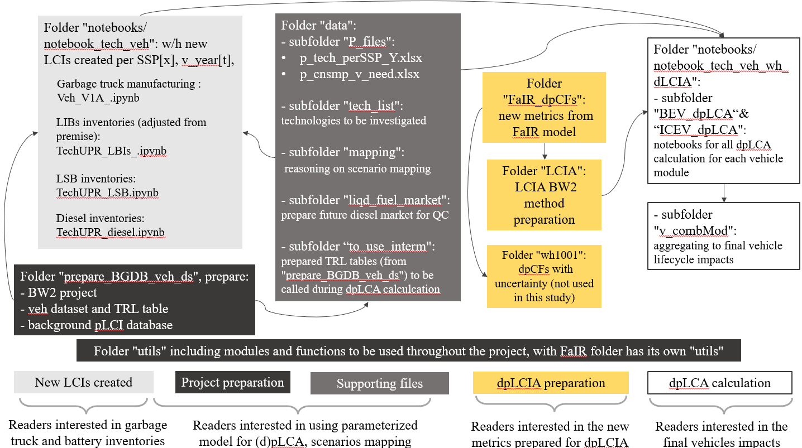

# dpLCA_GT

This repo supplements the dynamic and prospective Life Cycle Assessment study: "Ttile / DOI" 

### Folders have been re-structured as: 
- dpLCIA folders include FaIR metrics running, then preparing LCIA methods for brightway2 projects (yellow boxes below)
- GT_case folder include all data and notebooks for the garbage truck case study (gray boxes below)

How to navigate this repo: 

notebooks using absolute file path now, need to cleanup. 

### NOTE:

There are six large .nc vehicle output files not available under the "notebook/notebook_veh_wh_dLCIA/dlcia_output" folder:  

To re-produce the study to get final vehicle lifecycle impacts, two options: 
1.  run each notebook and save .nc output in local drive:
      -  for example, running "/notebook_veh_wh_dLCIA/BEV_dpLCA/V1AB_BEV_initY_dIRFCRF.ipynb" will generate a "V1AB_BEV_initY_dpIRFCRF.cn" file in local drive, which will be needed in the final aggregation calculation, e.g., you'll need those .nc files when running "v_combMod/Vcomb_BEV-GT_ds_concat.ipynb" notebook for final vehicle lifecycle impacts aggegration 

2.  download all. nc files from [here](https://drive.google.com/drive/folders/17XLtAt03GfyccHjU5_23MGgRrZBVQNby), and put them to the "notebooks/notebook_veh_wh_dLCIA/dlcia_output" folder to fun final vehicle lifecycle impacts aggregation
