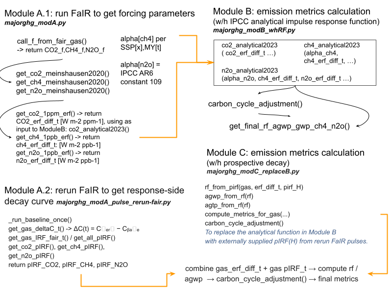

# How do we used FaIR 

this folder stores notebooks, modules, and outputs used to derive dynamic prospective climate metrics with FaIR-based parameters, with following folders:

- `utils/`: core python modules for module-based calculations and plotting helpers
- `output/`: generated response curves, metrics, and figures
- `data/`: FaIR species/configuration inputs data
- `some_analy/`: side analyses and comparison with older studies, it's obsolete with the old approach described below; a more updated benchmark with a new study (Watanabe & Cherubini 2026) is under `output/pIRF/*compare*/` folder, or several notebooks `*_comp_.ipybn` under the output folder

## Modeling evolution: old vs updated approach

### Old approach (Module **A.1 + B**)

- **Module A.1**: `majorghg_modA.py` - prospective forcing setup from scenario-depending perturbations
- **Module B**: `majorghg_modB_whRF.py` - applies an analytical IPCC-style impulse response function (IRF) on top of prospective forcing

In short, this approach uses **prospective forcing + IPCC analytical Impulse Response Functions**

### Updated approach (Module **A.2 + C**)

- **Module A.2**: `majorghg_modA_pulse_rerun-fair.py` - updated prospective forcing **AND** decay handling
- **Module C**: `majorghg_modC_replaceB.py` - replaces the IPCC analytical Impulse Response Functions with FaIR-informed response behavior for metric calculation

In short, this approach couples **prospective forcing + prospective decay**, so both forcing and decay are scenario/time dependent.

### Module flowchart

## Prospective decay (in the updated approach)

The prospective decay curve is obtained by rerunning FaIR with a unit pulse perturbation and normalizing by the initial post-pulse concentration jump:

Detailed note and derivation, see:`prospective-decay-rerunFaIR_perturbation.md`

## Output (new metrics) to be used in follow-up impact assessment

- Scenarios included: `ssp119`, `ssp126`, `ssp245`, `ssp434`, `ssp460`, `ssp585`

- Old modeling **prospective forcing + IPCC analytical**), use:
  `output/metrics_2026-02-23/`.
  - Files: `agwp_dcf_gwp100_tstep1{GAS}_{SCENARIO}_fair_start1750MY{YEAR}.xlsx`
 
- New modeling **prospective forcing + prospective decay**), use:
  `output/metrics_AGWP_wh_ModC_CC_T/`.
  - Files: `agwp_by_pIRF_tstep1{GAS}_{SCENARIO}_fair_start1750MY{YEAR}.xlsx`

---